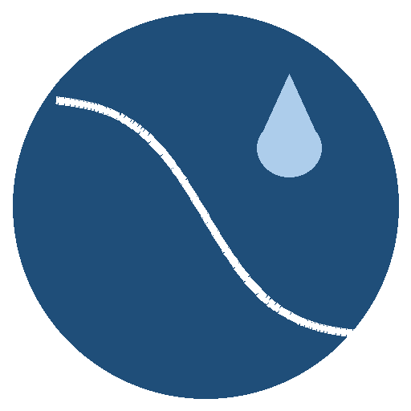

# SWRC/HCC Fitter

### Fit soil water‑retention & hydraulic‑conductivity curves — beautifully.

A polished desktop app for **soil hydraulic property** estimation across the
full moisture range: **125 retention models × 6 conductivity models**, three
fit objectives, two kinds of uncertainty, colour‑coded model comparison, and a
clean lab‑style interface — all in an embedded window, no browser required.

&nbsp;

<b>▶ Try it right now in your browser — no install: <a href="https://PTF.bluerror.com/">PTF.bluerror.com</a></b>

<b>📖 Full user manual with worked examples: <a href="https://bluerror.com/manual.html">bluerror.com/manual.html</a></b>

---

## ✨ Highlights

- 🧮 **125 retention models** — 8 basic functions × {uni·bi·tri‑modal} × 5 full‑range variants (original · Brunswick · PDI · FXW · Fayer–Simmons), plus 5 self‑contained full‑range functions (Rossi–Nimmo, Webb, Groenevelt–Grant, Lu, Zhang)
- 💧 **6 conductivity models** — 4 capillary‑bundle (Mualem/Burdine/AS/CCG) + Gardner exponential & power; **tick several to compare** alongside the retention models
- 🎯 **Three fit objectives** — **nRMSE**, **NSE**, or Gaussian **NLL** (puts θ and K on one scale)
- 📈 **Two uncertainty modes** — **bootstrap** CIs/bands, *or* **likelihood (NLL)** uncertainty with calibrated or user‑given σ
- 🌈 **Model comparison** — `Ctrl`+click models to overlay; each curve a distinct colour with its own matching 95 % band
- 📊 **Statistical analysis panel** — RMSE · NSE · KGE · NLL per branch, AICc, σ, water content & PAW; switch between models via a dropdown
- 📄 **Beautiful PDF report** — one‑click infographic report: dashboard KPIs, colour‑graded leaderboard, square θ(h)/K(h)/K(θ) plots, model‑comparison bar charts, and a detailed recommended‑model breakdown
- 🔬 **Residual plots** — observed − fitted vs. suction for the θ and K branches
- 🎚️ **Editable parameter bounds** — tighten or widen each parameter's search range right in the table
- 🗂️ **Built‑in example databases** — no data of your own? Load a real measured soil straight from **Hohenbrink et al. (2023)** (569 soils), **UNSODA 2.0** (329) or **EU‑HYDI** (2243) via *“No data? Try a database”*, or **[download all of them as an Excel workbook](https://github.com/Bluerrror/swrc-hcc-fitter/releases/latest/download/soil_hydraulic_databases.xlsx)** (SWRC + HCC sheets with `pF` and `Sample_ID`)
- 🔤 **Flexible input units** — suction in pF / cm / kPa / hPa and K in cm·d⁻¹ / cm·s⁻¹ / mm·h⁻¹ / m·s⁻¹
- 📑 **Excel sheet picker** — auto‑merges retention + conductivity sheets, with a manual sheet override
- ⏳ **Live progress + Cancel** — a progress bar during the fit and a working cancel button
- 💾 **Save / restore session** — download a fit (results + settings) as JSON and reopen it later
- 🔤 **Paper‑accurate symbols** — parameter labels follow each variant's source paper (θ_cs/θ_ncs for Brunswick, K_snc, τ_s … for PDI)
- 🖥️ **No browser, no Python needed** — embedded Qt window, one‑click installer
- 📂 **Smart file loading** — CSV, text, or Excel (`.xlsx`/`.xls`); auto-detects the delimiter (`,`/`;`/tab), decimal mark, the right Excel sheet, and where the data table starts (skips instrument metadata)
- 📤 **One‑click export** — fitted parameters and curves to CSV, plus the full PDF report

---

## 🌱 Retention models

**8 basic functions × 3 pore‑system modes (unimodal · bimodal · trimodal) × 5 full‑range variants = 120, plus 5 self‑contained full‑range functions = 125 retention models.**

Each basic capillary function can be wrapped by a **full‑range variant** that adds non‑capillary (adsorptive/film) water so θ → 0 at oven dryness (pF 6.8):

| Variant | Reference | Non‑capillary / dry‑end treatment |
|---|---|---|
| **original**  | classic capillary | none (flattens to θr) |
| **Brunswick** | Weber et al. 2019 *(WRR)* | integral‑derived non‑capillary saturation + film conductivity |
| **PDI**       | Peters, Durner & Iden 2024 *(VZJ)* | smoothed piecewise‑linear `S_nc`, air‑entry from `S_c` |
| **FXW**       | Rudiyanto et al. 2020 *(J. Hydrol.)* | Fredlund–Xing oven‑dryness correction `θ = θs·C(h)·Se` |
| **Fayer–Simmons** | Fayer & Simmons 1995 *(WRR)* | Campbell–Shiozawa log‑linear adsorption replaces θr |

> Basic functions: **van Genuchten** (m = 1−1/n) · **van Genuchten** (m, n free) ·
> **van Genuchten (Vogel–Císlerová** air‑entry, 1988**)** · **Brooks–Corey** (1964) ·
> **Campbell** (1974) · **Kosugi** (1996) · **Fredlund–Xing** (constrained & m‑free).

**Self‑contained full‑range functions** (native θ(h) reaching 0 at oven dryness; offered as standalone unimodal models, not crossed with the correction variants):
**Rossi–Nimmo** (1994) · **Webb** (2000) · **Groenevelt–Grant** (2004) · **Lu** (2016) · **Zhang** (2011).

## 💧 Conductivity models

Capillary‑bundle models compared in **Peters, Iden & Durner (2023, HESS)** — each
combinable with **every** retention curve:

| Model | Reference | Form |
|---|---|---|
| **Mualem** ⭐ | Mualem 1976 | `q=1, r=2` *(recommended)* |
| **Burdine** | Burdine 1953 | `q=2, r=1` |
| **Alexander–Skaggs** | Alexander & Skaggs 1986 | `q=1, r=1` |
| **Childs–Collis‑George** | Childs & Collis‑George 1950 | moment integral |
| **Gardner (exponential)** | Gardner 1958 | `K = Ks·exp(−kg·h)` |
| **Gardner (power)** | Gardner 1958 | `K = Ks/[1+(h/hk)^pk]` |

---

## 🎯 Fit objective & uncertainty

Choose the objective that scores the θ(h) and K(h) branches together:

| Objective | What it does | Uncertainty |
|---|---|---|
| **nRMSE** | range‑normalised RMSE, so θ and K weigh equally | bootstrap |
| **NSE**   | variance‑normalised (Nash–Sutcliffe) | bootstrap |
| **NLL**   | Gaussian negative log‑likelihood; jointly calibrates the mean (SSE) and noise **σ** | likelihood band |

- **Bootstrap** (nRMSE/NSE): resamples the data and refits to get 2.5–97.5 %
  parameter intervals and shaded curve bands. Set the number of refits (0 = off).
- **Likelihood / NLL**: replaces bootstrap with a Gauss–Newton covariance and
  Monte‑Carlo curve bands. σ can be **calibrated** (σ̂ = RMSE, the Gaussian MLE)
  or **fixed** to your own σθ/σK to control the θ‑vs‑K weighting. Every overlaid
  model gets its **own colour‑matched band**.

Reported metrics per branch: **RMSE · NSE · KGE · NLL**, plus **AICc** for model
selection and water‑content / plant‑available‑water summaries at standard suctions.

---

## 🚀 Install

1. **[Download `SWRC-HCC-Fitter-setup.exe`](../../releases/latest)** and run it
   *(published by **PEN‑PTF**)*.
2. Follow the wizard. Click **Yes** when Windows offers to install the
   **Microsoft Visual C++ runtime** (one‑time, required by Qt).
3. The installer ships **uv** + the VC++ runtime, then uv fetches a private
   Python 3.12 + scientific stack (Dash, Plotly, NumPy, pandas, SciPy, PySide6).
   ⏳ *Needs internet on first install — a couple of minutes; instant & offline after.*
4. Launch **SWRC‑HCC Fitter** from the Start Menu or Desktop.

---

## 📂 Data format

Upload **CSV, text, or Excel** files — one combined file **or** separate retention/conductivity files. The reader auto-detects the delimiter (comma, semicolon, or tab), the decimal mark (e.g. European `;` + `,`), the best worksheet in an Excel workbook, and the data block even when there are metadata/preamble rows above it. Then map columns to roles in the UI (auto‑guessed):
`pF (ret.)`, `θ`, `pF (cond.)`, `K`, and an optional `sample_id` (pick one sample
to fit). A sample may have only SWRC or only HCC — whichever is present is fitted.
Hover the **ⓘ** badge on any panel for an in‑app explanation.

---

## 📝 Citation

If you use SWRC/HCC Fitter in your work, please cite:

> Shojaeezadeh, S.A. *SWRC/HCC Fitter tool for fitting soil water retention and hydraulic conductivity curves over the full moisture range* (under review).

## 🗂️ Example databases

The app ships with three public soil hydraulic databases you can load without any file of your own (**No data? Try a database**), and the same data is available as a **[downloadable Excel workbook](https://github.com/Bluerrror/swrc-hcc-fitter/releases/latest/download/soil_hydraulic_databases.xlsx)** — one `*_SWRC` and one `*_HCC` sheet per source, each with `Sample_ID`, `pF`, and the measured values:

- **Hohenbrink et al. (2023)** — German database, 569 soils (evaporation method + dewpoint + saturated *K*).
- **UNSODA 2.0** (Nemes et al., 2001; Leij et al., 1996) — global, 329 soils; independent cross‑database test set.
- **EU‑HYDI** (Weynants et al., 2013) — European Hydropedological Data Inventory, 2243 soils; independent test set.

**Please also cite the database(s) you use:**

- Hohenbrink, T., Jackisch, C., Durner, W., Germer, K., Iden, S., Kreiselmeier, J., et al. (2023). Soil water retention and hydraulic conductivity measured in a wide saturation range. *Earth System Science Data*, 15, 4417–4432. <https://doi.org/10.5194/essd-15-4417-2023>
- Nemes, A., Schaap, M. G., Leij, F. J., & Wösten, J. H. M. (2001). Description of the unsaturated soil hydraulic database UNSODA version 2.0. *Journal of Hydrology*, 251(3–4), 151–162. <https://doi.org/10.1016/S0022-1694(01)00465-6> — original report: Leij, F. J., Alves, W. J., van Genuchten, M. Th., & Williams, J. R. (1996). *The UNSODA Unsaturated Soil Hydraulic Database*. EPA/600/R‑96/095.
- Weynants, M., Montanarella, L., Tóth, G., et al. (2013). *European Hydropedological Data Inventory (EU‑HYDI)*. Publications Office of the European Union, Luxembourg. <https://doi.org/10.2788/5936>

## 📜 References

*Full‑range variant frameworks*
- **Weber, Durner, Streck & Diamantopoulos (2019)**, *WRR* 55:4994 — modular (Brunswick) framework. <https://doi.org/10.1029/2018WR024584>
- **Peters, Durner & Iden (2024)**, *VZJ* 23:e20338 — the PDI model system. <https://doi.org/10.1002/vzj2.20338>
- **Rudiyanto et al. (2020)**, *J. Hydrol.* 588:125041 — FXW full‑range Fredlund–Xing + Wang conductivity. <https://doi.org/10.1016/j.jhydrol.2020.125041>
- **Wang, Jin & Deng (2018)**, *WRR* 54:6860 — complete‑range hydraulic conductivity. <https://doi.org/10.1029/2018WR023037>
- **Fayer & Simmons (1995)**, *WRR* 31:1233 — adsorption (Campbell–Shiozawa) modification. <https://doi.org/10.1029/95WR00173>

*Self‑contained full‑range functions*
- **Rossi & Nimmo (1994)**, *WRR* 30:701 — saturation to oven dryness. <https://doi.org/10.1029/93WR03238>
- **Webb (2000)**, *WRR* 36:1425 — log‑linear dry‑region extension. <https://doi.org/10.1029/2000WR900057>
- **Groenevelt & Grant (2004)**, *Eur. J. Soil Sci.* 55:479 — residual‑free retention. <https://doi.org/10.1111/j.1365-2389.2004.00617.x>
- **Lu (2016)**, *JGGE* 142:04016051 — generalized adsorption + capillarity. <https://doi.org/10.1061/(ASCE)GT.1943-5606.0001524>
- **Zhang (2011)**, *VZJ* 10:1299 — oven‑dry to saturation retention & permeability. <https://doi.org/10.2136/vzj2011.0019>

*Conductivity*
- **Peters, Iden & Durner (2023)**, *HESS* 27:4579 — comparison of capillary‑bundle conductivity models. <https://doi.org/10.5194/hess-27-4579-2023>

## 🔗 Links

- 👤 **GitHub — [Bluerrror](https://github.com/Bluerrror)**
- ⚙️ **Forward‑model engine — [pyspsh](https://github.com/Bluerrror/pyspsh)**
- 🎓 **[Soil Science Section, University of Kassel](https://www.uni-kassel.de/fb11agrar/en/fachgebiete-einrichtungen/bodenkunde/home.html)**

Built on the **pyspsh** soil‑physics forward model, with the numerical fitting
re‑implemented in pure **NumPy + SciPy** (`differential_evolution`) for speed.

Released under the **MIT License** — see [LICENSE](LICENSE).
